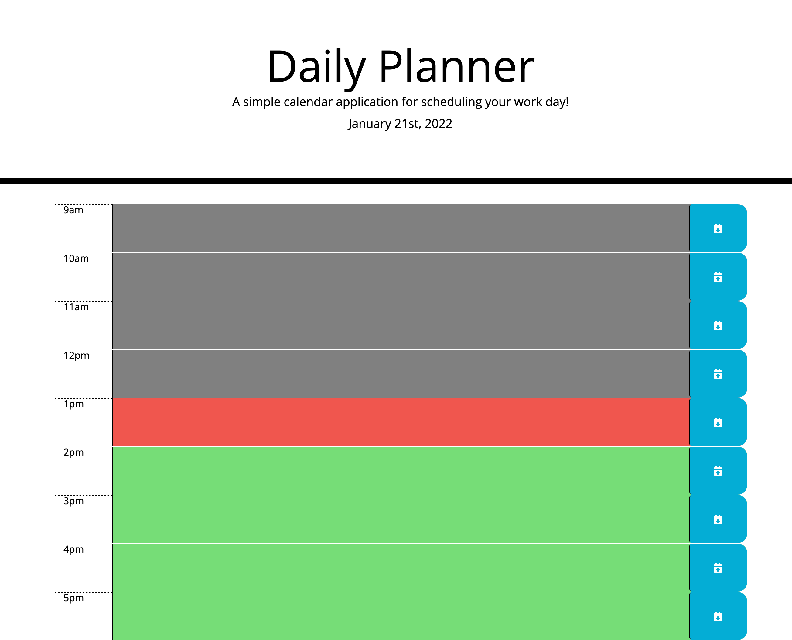

# Every Day Planner

# Description

- A daily planner to help keep your work day schedueled hour by hour.
- Color coated to represent, present, past and future tasks.

# How to use

- Type in the task you need acomplished into which hour of the day it belongs.
- Next click the save button, or the calendar icon.
- Daily tasked will be saved in Local Storage.

- Present tasks will be highlighted in red.
- Past tasks will be highlighted in grey.
- Future tasks will be highlighted in green.

# Screenshot of Planner

;

# Author

- Rachel Haddad

## Link to Repository and Page

- Here is the repo: [https://github.com/buttercupsmom/hw5]
- Here is the page: [https://buttercupsmom.github.io/hw5/]
